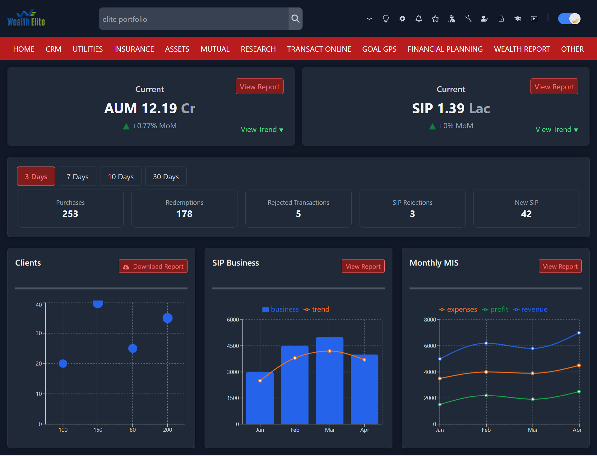

# Financial Dashboard - Next.js Project

A modern, responsive financial dashboard built with Next.js 14, featuring comprehensive data visualization, dark mode support, and mobile-first design.

## 🖼️ Screenshots

### Desktop View (Light Mode)


### Desktop View (Dark Mode)


### Mobile View


## 🚀 Features

### Core Features
- **Responsive Navigation Bar** with hamburger menu for mobile
- **AUM & SIP Cards** displaying current values and MoM changes
- **Interactive Time Range Filters** (3 Days, 7 Days, 10 Days, 30 Days)
- **Statistics Cards** for Purchases, Redemptions, Rejected Transactions, SIP Rejections, and New SIP
- **Advanced Charts**:
  - Clients Distribution (Bubble Chart)
  - SIP Business (Combined Bar + Line Chart)
  - Monthly MIS Report (Multi-line Chart)

## 🛠️ Tech Stack

- **Framework**: Next.js 14 (App Router)
- **Styling**: Tailwind CSS
- **Charts**: Recharts
- **Icons**: React Icons 
- **Language**: TypeScript

## 📦 Installation & Setup

### Prerequisites
- Node.js 18.x or higher
- npm or yarn package manager

### Steps

1. **Clone the repository**
   ```bash
   git clone https://github.com/saket-gupta99/financial-dashboard.git
   cd financial-dashboard
   ```

2. **Install dependencies**
   ```bash
   npm install
   # or
   yarn install
   ```

3. **Run the development server**
   ```bash
   npm run dev
   # or
   yarn dev
   ```

4. **Open your browser**
   ```
   Navigate to http://localhost:3000
   ```


## 🔧 Available Scripts

- `npm run dev` - Start development server
- `npm run build` - Build for production
- `npm run start` - Start production server
- `npm run lint` - Run ESLint for code quality

## 📱 Responsive Breakpoints

- **Mobile**: < 768px (Logo + Hamburger menu)
- **Tablet**: 768px - 1023px (Logo + Search + Hamburger)
- **Desktop**: ≥ 1024px (Full navigation with all icons)

